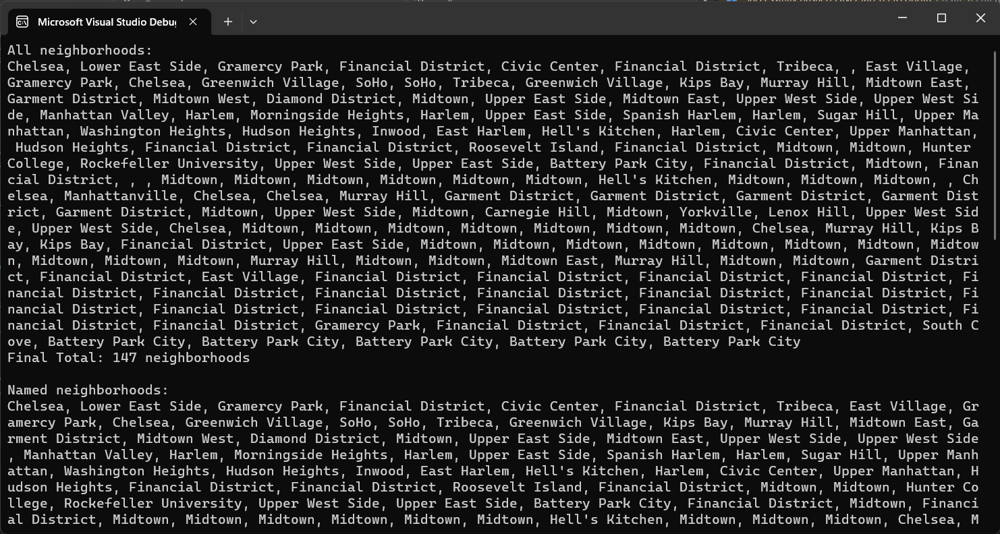

# LINQ

## Desciption:
this is a simplecode that takes the data from a json and converts it to a object from a class to ues it in  c# code and impiement the linq methods and query on thiem.
## Visual:


 ## Walk Through:
this program at first takes the data from the data json file and then converts it to an instate of the rootObject .
```c# 
var neighborhoods = rootObject.features.Select(f => f.properties.neighborhood);
```
in the above code we have stored all the neighborhoods using select. 
 first query : we will apply thre select linq method to get all the neighborhoods in the object then we applied the join to the return to display them abnd used the count.
then we will apply thre select linq method to get all the neighborhoods in the object then we applied the join to the return to display them .
```c# 
  var namedNeighborhoods = neighborhoods.Where(n => !string.IsNullOrEmpty(n));
```
 second query : we will apply thre where linq method to get all the neighborhoods that are not null or empty in the object then we applied the join to the return to display them abnd used the count.
 then we applied the join to the return to display them .

 ```c# 
  var distinctNeighborhoods = namedNeighborhoods.Distinct();
```
third query : we will apply thre Distinct linq method to get all the neighborhoods that are duplicated in the object then we applied the join to the return to display them abnd used the count.
 then we applied the join to the return to display them .
  ```c# 
  var consolidatedNeighborhoods = rootObject.features
                .Select(f => f.properties.neighborhood)
                .Where(n => !string.IsNullOrEmpty(n))
                .Distinct();
```
fourth query : we will apply all the above  linq method to get all the neighborhoods that are duplicated and there not null and empty the object then we applied the join to the return to display them abnd used the count.
 then we applied the join to the return to display them .
 ```c# 
   var consolidatedNeighborhoodsQuerySyntax = (from f in rootObject.features
                                                        let n = f.properties.neighborhood
                                                        where !string.IsNullOrEmpty(n)
                                                        select n).Distinct();
```
fourth query : we will apply all the above  linq method but insted of using methods we used the query sntax.
